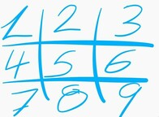

# Tic Tac Toe 
[1]

## Game Instructions

Tic Tac Toe is a two-player game on a 3x3 board. The game is played by turns and in each, you will draw an X or an O in an available space on the board (see images below). The winner is the player that can put his/her symbol consecutively in a line (can be a row, column or a diagonal.)

[1]

## How to play this game

- To initialize the game you can call in the terminal of this folder type "bin/main.rb" without quotation marks.

- It should prompt a text that asks for the first player name and then for the second player name. (remember to press enter after you finish typing)

- Now, it will print the board and the spaces available for you to choose, from 1 to 9 (see the corresponding position of the number in the image below). You will choose one and then press enter.

> 

- If you select an incorrect value, you will be asked to put the correct one! A message on the screen will tell you.

- Enjoy! The screen will show you who is the winner!... or if none of you won.

- And last but not least, after the game is over and you want to play again, you just have to type y or Y in the screen and press enter. The player will automatically change positions (The one that started in the first game will be the second in the other one, and so on...).

## Reference

- [1] "*Images were taken from [Wikipedia](https://en.wikipedia.org/wiki/Tic-tac-toe)*"

# About the file

## Built With

- Ruby
- VSCode

## Live Demo
You can check the live version here: **pending**

## Authors

👤 **Joseph Flores**
- Github: [@YoseptF](https://github.com/YoseptF)
- Twitter: [@Yosept__](https://twitter.com/Yosept__)
- Linkedin: [Joseph Flores](https://www.linkedin.com/in/joseph-flores-928505106/)

👤 **Lucas Mazo**
- Github: [@lucasmazo32](https://github.com/lucasmazo32)
- Twitter: [@lucasmazo32](https://twitter.com/lucasmazo32)
- Linkedin: [Lucas Mazo](https://www.linkedin.com/in/lucas-mazo-meza-55a65b159/)